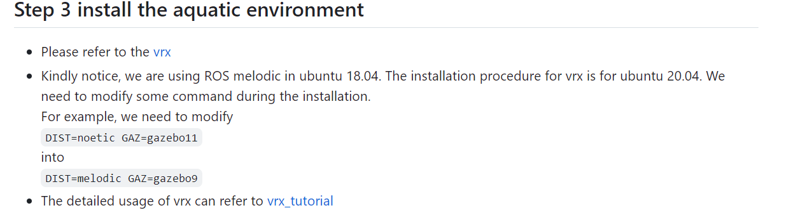

ros package for auto_landing

I have currently achieved the landing of a single unmanned aerial vehicle on a shaking platform. The results can be seen from this [video](https://drive.google.com/file/d/1Du2hd4LyCqpviYpElHeEIIWHoj1bF2gY/view?usp=sharing)

## Installation

Please refer to [environment_setup](https://github.com/120090049/auto_landing/wiki) to setup px4 and mavros.
After then, cd to your work space.

```Python
git clone https://github.com/120090049/auto_landing.git  
catkin_make  
source /home/username/catkin_ws/devel/setup.bash   
```

or add it to the ~/.bashrc



